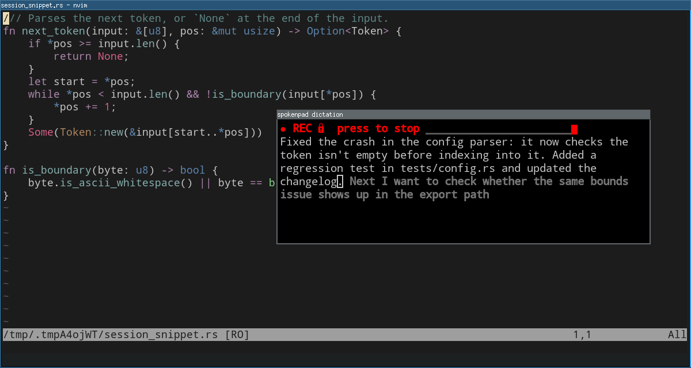

# spokenpad

Offline push-to-talk dictation for Linux. Hold a key, speak, and release: the
text appears in a Neovim window that never takes focus. Speech recognition runs
locally on the CPU, and nothing is ever pasted or typed into other
applications.



## Features

- **Push-to-talk, or latch.** Hold a key while you speak. Press Shift with
  it and recording keeps running after you let go, until you press the key
  again.
- **Text appears while you speak.** Each finished sentence lands in the file
  during the recording, and a live preview of the sentence you are in is
  shown where it will land. Releasing the key only decodes the last second
  or so, however long you talked.
- **Nothing is lost.** Every recording is also saved as a WAV. If a decode
  fails, `spokenpad transcribe` recovers the text from it.
- **Works on any desktop.** You bind the commands to keys in your window
  manager; spokenpad reads no keyboard and needs no special permissions. Its
  own dictation window opens beside the mouse pointer without taking the
  focus (X11, and Wayland through Xwayland); anywhere else, you open the
  editor in any terminal.
- **Parakeet TDT 0.6B v3**, downloaded on first use, or another NeMo
  transducer from sherpa-onnx. It can be biased towards your own vocabulary.

## Installation

Requires Linux on x86-64, Neovim 0.10 or newer, PortAudio, and about 700 MB
of disk and 1.2 GB of RAM for the speech model. The dictation window also
needs an X display (Xwayland is fine), `fontconfig`, `libxcb`,
`libxkbcommon-x11`, and `xclip` to copy text out.

### Arch Linux

spokenpad is not in the AUR. Build the package from this repository:

```sh
git clone https://github.com/membranepotential/spokenpad
cd spokenpad/packaging/aur
makepkg -si
```

This installs `/usr/bin/spokenpad`, the systemd user socket
`spokenpad.socket` (enabled for every user; it starts the daemon on the
first key press), example key bindings in `/usr/share/spokenpad/`, and
`config.example.toml` in `/usr/share/doc/spokenpad/`. It upgrades and
removes cleanly like any other package.

### From source (any distro)

Needs Rust 1.88 or newer, a C/C++ toolchain and `pkg-config`.
`packaging/sherpa-archive.sh` downloads the prebuilt sherpa-onnx libraries
the binary links and checks them against a pinned sha256:

```sh
git clone https://github.com/membranepotential/spokenpad
cd spokenpad
packaging/sherpa-archive.sh ~/.cache/spokenpad-sherpa
SHERPA_ONNX_ARCHIVE_DIR=~/.cache/spokenpad-sherpa cargo install --locked --path . --root ~/.local
mkdir -p ~/.config/systemd/user/spokenpad.service.d
cp packaging/systemd/spokenpad.{socket,service} ~/.config/systemd/user/
cp packaging/systemd/dev.conf.example ~/.config/systemd/user/spokenpad.service.d/dev.conf
systemctl --user daemon-reload
systemctl --user enable --now spokenpad.socket
```

The drop-in points the service at `~/.local/bin/spokenpad`.

### First run

1. [Bind your keys](#bind-your-keys).
2. Hold the push-to-talk key and speak. The first press downloads the speech
   model (about 670 MB, checked against pinned sha256 sums); what you say
   meanwhile is recorded and transcribed once the model is ready.

`spokenpad check` validates the config, loads the model and says whether the
dictation window can open here. If the window does not open, see
[Display and the systemd user manager](docs/usage.md#display-and-the-systemd-user-manager).
After an upgrade, `systemctl --user restart spokenpad` picks up the new
binary.

## Bind your keys

spokenpad reads no keyboard. Bind these commands in your window manager:

| command | bind it to |
|---|---|
| `spokenpad start` | the push-to-talk key going down |
| `spokenpad stop` | the same key coming up |
| `spokenpad toggle` | Shift and the same key: start a latched recording, or end the running one |
| `spokenpad cancel` | a key you can reach while holding the push-to-talk key |

Use a single key for push-to-talk, not a chord: a chord whose modifier comes
up first may never run the release binding. The examples use **Pause** to
talk and **Scroll Lock** to cancel; F13 to F24 are good choices too. Don't
bind `cancel` to Escape. `xev` (X11) or `wev` (Wayland) shows a key's name
and keycode. Commented copies of the i3 and sway bindings are installed in
`/usr/share/spokenpad/`.

**i3** (`~/.config/i3/config`):

```
set $spokenpad_talk Pause
set $spokenpad_cancel Scroll_Lock
bindsym $spokenpad_talk exec --no-startup-id spokenpad start
bindsym --release $spokenpad_talk exec --no-startup-id spokenpad stop
bindsym Shift+$spokenpad_talk exec --no-startup-id spokenpad toggle
bindsym $spokenpad_cancel exec --no-startup-id spokenpad cancel
exec_always --no-startup-id xset -r 127
```

`xset -r 127` turns off auto-repeat for keycode 127 (Pause); use your key's
keycode from `xev`. Without it, a Shift+Pause held past the repeat delay
ends its own latch.

**sway** (`~/.config/sway/config`):

```
set $spokenpad_talk Pause
set $spokenpad_cancel Scroll_Lock
bindsym --no-repeat $spokenpad_talk exec spokenpad start
bindsym --release $spokenpad_talk exec spokenpad stop
bindsym --no-repeat Shift+$spokenpad_talk exec spokenpad toggle
bindsym --no-repeat $spokenpad_cancel exec spokenpad cancel
```

**Hyprland** 0.55 and newer (Lua config; binds do not repeat):

```lua
hl.bind("Pause", hl.dsp.exec_cmd("spokenpad start"))
hl.bind("Pause", hl.dsp.exec_cmd("spokenpad stop"), { release = true })
hl.bind("SHIFT + Pause", hl.dsp.exec_cmd("spokenpad toggle"))
hl.bind("Scroll_Lock", hl.dsp.exec_cmd("spokenpad cancel"))
```

Hyprland 0.54 and older (`hyprland.conf`):

```
bind = , Pause, exec, spokenpad start
bindr = , Pause, exec, spokenpad stop
bind = SHIFT, Pause, exec, spokenpad toggle
bind = , Scroll_Lock, exec, spokenpad cancel
```

**GNOME, KDE Plasma and other desktops** run a shortcut only when the key
goes down, so push-to-talk is not possible there. Add custom shortcuts for
`spokenpad toggle` (tap to start, tap to stop), such as Super+Alt+D, and
`spokenpad cancel`, such as Super+Alt+X.

## Usage

- **Dictate:** hold the key, speak, release. Each recording becomes its own
  paragraph in the dictation file, saved as it lands.
- **Latch:** Shift+key, let go, keep talking; press the key again to stop. A
  forgotten latch stops by itself after five minutes without speech.
- **Cancel:** the cancel key, or closing the window, while recording. Text
  already written stays.
- **Edit and copy:** the window is a normal Neovim; what you type is saved as
  you type it. `"+y` copies to the clipboard; in Insert mode Ctrl+V pastes.
- **Files:** `~/.local/state/spokenpad/dictation/`, one Markdown file per
  window.
- **Recover:** every recording is kept as a WAV in
  `~/.local/state/spokenpad/audio/`, pruned oldest-first at 5 GB.
  `spokenpad transcribe FILE.wav` decodes one again.
- **Another microphone:** `spokenpad check` lists them; set `audio.device`.
- **Logs:** `journalctl --user -u spokenpad -f`, and the debug log in
  `~/.local/state/spokenpad/spokenpad.log`. Neither holds what you
  dictated.

[docs/usage.md](docs/usage.md) describes every notice in the winbar, the
limits, the window modes, and what happens across restarts.

## Configuration

spokenpad reads `~/.config/spokenpad/config.toml`. Every key is optional, and
an unknown key is an error. [`config.example.toml`](config.example.toml)
documents every key at its default; copy only what you change. `[nvim]`
changes apply to the next window; everything else after
`systemctl --user restart spokenpad`.

| key | default | what it does |
|---|---|---|
| `nvim.mode` | `"pane"` | `"pane"`: spokenpad opens its own window; `"attach"`: you run `spokenpad editor` in a terminal |
| `nvim.init` | your Neovim config | `"bundled"` opens the window about 3× faster; pair it with `nvim.colorscheme` |
| `nvim.font_family`, `nvim.font_size` | `"monospace"`, `12` | the pane's font, in points as Alacritty's `font.size` |
| `nvim.pane_dimensions` | `{ columns = 72, lines = 20 }` | the pane's size in cells |
| `nvim.pane_layout` | `"floating"` | `"tiled"` tiles it on i3 and sway |
| `asr.vocabulary` | `[]` | words to bias the model towards, such as `["kubectl", "nginx"]` |
| `capture.silence_timeout_seconds` | `300` | a latch without speech this long ends by itself; `0` turns it off |

## Command line

```
spokenpad start | stop            begin or end a push-to-talk capture
spokenpad toggle                  begin a latched capture, or end the running one
spokenpad cancel                  discard the capture being recorded
spokenpad editor                  open the dictation editor in this terminal
spokenpad transcribe WAV [--out PATH] [--from SECONDS]
                                  decode a recording, from SECONDS in
spokenpad check                   validate the config, load the models, list the microphones
spokenpad fetch-models [--dir DIR]
                                  download the default models ahead of time
spokenpad daemon                  run the daemon (what the service runs)
```

Global options: `-c/--config PATH`, `--model-dir DIR`, `-v/--verbose`,
`--log-file PATH`. Exit codes: [docs/usage.md](docs/usage.md#exit-codes).

## Accuracy and speed

On 75 minutes of the author's own dictation (181 recordings, replayed through
the daemon's own path), the default model scores **9.6% word error rate on
English and 17.3% on German**, and decodes 13–17× faster than real time on
an i7-9850H with 6 threads. That is one speaker on one microphone, scored
against another recogniser's transcripts rather than a person's. Details:
[docs/evaluation.md](docs/evaluation.md).

## Development

```sh
cargo build --locked --release
cargo test --locked --all-targets                  # no keyboard, microphone or display needed
cargo test --locked --test e2e -- --ignored        # loads the real models (spokenpad fetch-models first)
cargo clippy --locked --all-targets -- -D warnings
cargo fmt --check
```

Technical documentation is in [docs/](docs/README.md): the
[architecture](docs/architecture.md), the
[hard constraints](docs/constraints.md), the
[progressive commit](docs/progressive-commit.md) design, the
[dictation window](docs/nvim-window.md), and the
[decision log](docs/decisions.md).

## License

spokenpad's source is MIT, see [LICENSE](LICENSE). The binary also contains
sherpa-onnx (Apache-2.0), ONNX Runtime (MIT) and the other libraries of
sherpa-onnx's prebuilt archive, eSpeak NG (GPL-3.0-or-later) among them; the
default models it downloads are NVIDIA's Parakeet TDT 0.6B v3 (CC-BY-4.0)
and Silero VAD (MIT). [THIRD-PARTY.md](THIRD-PARTY.md) lists every component
and its licence.
