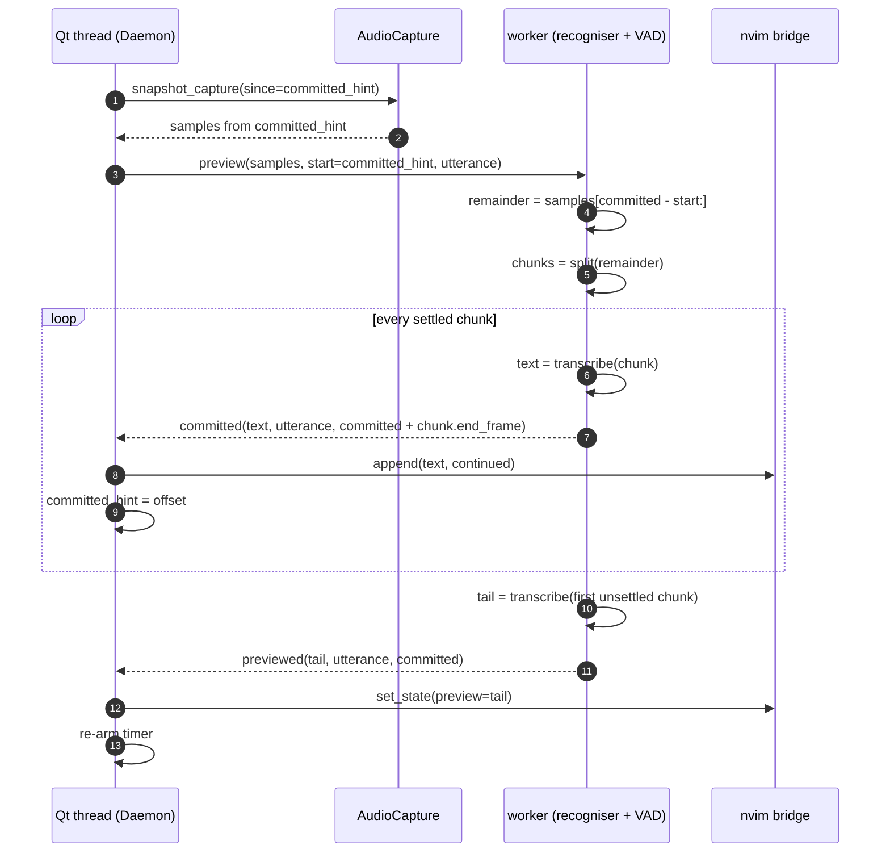
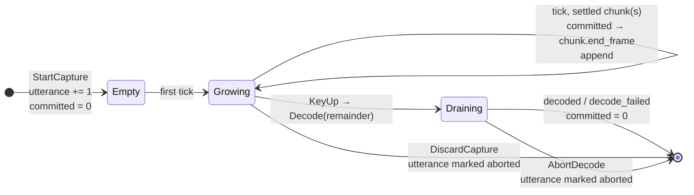

# Progressive commit: decode while speaking, finish at the tail

← [docs index](README.md) | Rewrites the decode half of
[constraints.md](constraints.md#every-committed-sample-is-decoded-exactly-once-never-streamed);
the module map is in [architecture.md](architecture.md), the window in
[nvim-window.md](nvim-window.md).

**Status: design, 2026-09-08.** Implemented in the same change set; the
"as built" notes at the end say where the code diverged from this text.

## The problem

Two complaints from live use on 2026-09-08, both from the same root cause:

| what happened | measured |
|---|---|
| Stop takes forever on a long passage | 379 s held → **31.5 s** to text; 821 s held → **54.5 s** |
| The live preview crops its beginning once the window is full | 8 wrapped lines shown, everything before them gone |

Both come from where the committed decode sits: *all of it* runs after the
key comes up. The preview already decodes settled chunks as they close, but
only to show them, so at key release the whole capture is decoded a second
time from zero. The wait is linear in the passage, and the preview has to hold
the entire transcript as virtual text because nothing has been written yet.

The first complaint is the one that costs: 30-55 s of watching a spinner is
where the 2026-09-08 cap loss came from (the user kept talking past what the
old design could hold). The second is the visible symptom of the same
architecture.

## Goal

Text is committed to the buffer **while the user is still speaking**, as soon
as the audio it comes from cannot change any more. Stopping then only has to
decode the open tail, so the wait at key release is bounded by one chunk, not
by the passage.

### Non-goals

* A streaming recogniser, or re-decoding a growing buffer. The rule that
  every committed sample is decoded **exactly once** stays; only *when* moves.
* Changing the VAD, the model, or the accuracy trade
  (`vad.chunk_seconds` = 10 s of speech per chunk, measured in
  [asr.md](asr.md)). The chunks committed live start where the whole-buffer
  split's chunks start, to within the pad; the text is not byte-identical at
  boundaries, and the measured accuracy is no worse (see "As built").
* Replacing Qt as the event loop. The PySide6 *overlay* goes (see
  [legacy removed](#legacy-removed)); the Qt threads, timers and queued
  signals stay until the Rust rewrite the user has pencilled in, because
  swapping them for hand-rolled queues changes no behaviour and would be
  thrown away by that rewrite.

## Vocabulary

| term | meaning |
|---|---|
| **capture** | the audio accumulating since key-down, in memory *and* on disk ([recorder](architecture.md#event-flow)) |
| **chunk** | what `vad.SpeechSegmenter.split` returns: detected runs of speech merged until they hold `chunk_seconds` of speech, padded by real surrounding audio |
| **settled chunk** | a chunk no later audio can change: closed by the merge target *and* followed by ≥ 1 s of audio, or by another chunk |
| **open tail** | everything after the last settled chunk. Grows while the user speaks |
| **committed offset** | the frame in the capture up to which text has been committed. Owned by the worker; only ever grows within an utterance |
| **commit** | decode once, append to the dictation buffer, advance the committed offset |
| **preview** | decode the open tail, show it as virtual text below the committed text. Cosmetic; replaced on every tick |

### Why "settled" can be decided on a growing buffer

Silero is causal and `SpeechSegmenter.split` resets it and runs it from the
committed offset every tick. Given the same audio prefix it emits the same
spans in the same order, so a span that ended by *silence* on one tick ends
at the same frame on every later tick. The only span that can move is the one
`flush()` closed at the buffer's end because the user was mid-word. That span
is always the last, so:

* every chunk **before the last** is settled -- its spans all ended on their
  own, and the merge that closed it saw the same spans it will always see;
* the **last** chunk is settled only if it reached the merge target *and* the
  buffer runs ≥ 1 s past its end with no new speech. A flushed span ends
  within a frame of the buffer's end, so it can never pass that test.

`Segment` carries the answer as a field (`settled: bool`) rather than leaving
the caller to re-derive it, and carries `end_frame` -- where the detector said
the speech ends, *before* the trailing pad -- so the next remainder starts at
the speech boundary and the following chunk keeps its own lead pad. Advancing
by the padded length was a latent bug in the preview prefix: after a pause
longer than the lead pad the next remainder began inside the previous chunk
and re-found the tail of its speech. Cosmetic there; a duplicated sentence
here.

## The tick

While recording, a single-shot timer on the Qt thread fires every
`preview.interval_ms` (re-armed after each result, gap
`max(interval - decode, decode)` as before). Each tick:



Two offsets, deliberately. The **worker's** `committed` is the truth: it is
the single thread on which decodes are serialised, so it is the only place
where "this audio has been committed" can be decided without a race. The
**daemon's** `committed_hint` is a lagging copy fed by the `committed` signal.
It exists only so the snapshot does not copy the whole capture every second
(a one-hour latched passage is 230 MB), and it is always ≤ the worker's
value, which is why the worker slices `samples[committed - start:]` rather
than trusting `start`.

## Key release

```mermaid
sequenceDiagram
    autonumber
    participant Q as Qt thread (Daemon)
    participant W as worker
    participant B as nvim bridge

    Q->>W: abandon_previews.set()
    Q->>W: decode(all samples, utterance)
    Note over W: a preview mid-flight stops<br/>after its current chunk;<br/>what it committed stands
    W->>W: remainder = samples[committed:]
    W->>W: decode_capture(remainder) -- same pipeline as spokenpad transcribe
    loop every chunk of the remainder
        W-->>Q: committed(text, utterance, …)
        Q->>B: append(text, continued)
    end
    W-->>Q: decoded(full text, elapsed, tail seconds, utterance)
    Q->>Q: DecodeFinished → Idle
```

`decode_capture` is unchanged and still shared with `spokenpad transcribe`:
the recovery path decodes a wav from frame zero, the live path decodes the
remainder, and both go through the same segmentation, model, retry and
post-processing. The whole-buffer retry ("every chunk decoded to nothing")
now applies to the remainder, which is the audio it can still do something
about.

### Latency budget at release

| step | bound | why |
|---|---|---|
| preview already inside a decode | ≤ 1 chunk decode | cannot be interrupted; ~0.8 s for 10 s of speech at 12× |
| tail decode | ≤ 1 chunk + `max_speech_seconds` | the open tail is at most one unclosed chunk |
| append | 14-62 ms | measured, off the path |

Expected ≈ 1 s, worst ≈ 2.5 s, **independent of passage length**. Against
31.5 s and 54.5 s on the two passages that prompted this.

## The offset through an utterance



Every message between the worker and the daemon carries the **utterance id**
(bumped at every `StartCapture`), and that id does three jobs that the old
`generation` counter and the "capture got shorter" heuristic did between
them:

* the worker resets its committed offset when the id changes, so preview
  state can never leak from one utterance into the next -- explicitly,
  instead of by noticing that `samples.size` shrank;
* the daemon keeps a set of **aborted** ids; a `committed` for one is dropped.
  A cancel during recording or during the tail decode means "stop adding";
  what is already in the buffer stays, as it already did for a cancel during
  a segmented decode;
* the daemon remembers which utterance owns the **last paragraph**, and a
  segment extends it only if it is from that utterance. The old per-decode
  boolean was reset by the *next* utterance's decode, so a slow decode still
  landing would open a fresh paragraph mid-passage.

`DecodeFinished` is dispatched only for the current utterance. Previously the
older of two in-flight decodes could settle the newer one's `Transcribing`
state early; with a tail decode of ~1 s two in flight is nearly impossible,
but the check costs one comparison.

## Invariants

The constraint in [constraints.md](constraints.md) is reworded from
"one-shot committed decode at key release" to the following. The property it
protects -- what broke Handy -- is unchanged: **no committed text ever comes
from re-decoding a growing buffer, and no audio is discarded at any length.**

1. **Every committed sample is decoded exactly once.** A chunk is decoded when
   it settles or at release, never both. The committed offset only grows
   within an utterance.
2. **Only settled audio is committed live.** The rule above is the whole test:
   a chunk before the last, or the last chunk closed and followed by ≥ 1 s.
3. **The preview is the open tail, and only the open tail.** It is virtual
   text, bounded by one chunk, replaced every tick, and it never reaches the
   buffer. Nothing in `run_decode` reads it. The guard against a preview that
   *shrank* is kept, but keyed on the committed offset: when a chunk commits
   the tail legitimately restarts from nothing.
4. **Release waits for at most one chunk.** A preview already decoding
   finishes its chunk (it is committing, not wasting) and stops; the tail
   decode is bounded by the chunk size.
5. **Cancel means stop adding.** During recording, at release, or during the
   tail: nothing further lands, nothing already landed is removed. The wav on
   disk is untouched either way.
6. **Nothing is lost past any limit.** The in-memory ceiling still only bounds
   RAM; the recorder still sees every callback first; `spokenpad transcribe`
   still recovers a whole capture from the wav.

What is *weaker* than before, stated plainly: a cancel during recording used
to mean the capture never existed. Now the settled chunks of it are in the
file. That is the price of committing while speaking, it matches what a
cancel already meant during a segmented decode, and the file is the user's to
edit.

## What the user sees

* Text lands in the buffer roughly every 10-15 s of speech, one to two
  seconds after the pause that closed the chunk. The paragraph grows; nothing
  is cropped.
* Below it, in preview colours, the current sentence -- at most one chunk,
  usually two or three lines. It restarts from nothing each time a chunk lands
  above it.
* At release, `transcribing…` for about a second while the tail lands. The
  winbar's "showing the live preview until it lands" text stays; it now
  describes a second, not a minute.
* Nothing changes for short utterances. Under ~10 s of speech no chunk settles
  before release, so the whole thing is decoded once at release, exactly as
  today.

## Interfaces

Types first, per the house style. `vad.Segment` gains two fields:

```python
@dataclass(frozen=True, slots=True)
class Segment:
    samples: MonoAudio
    start_seconds: float   # where `samples` begins in the input, pad included
    end_frame: int         # where the speech ends in the input, pad excluded
    settled: bool          # no later audio can change this chunk
```

`AudioCapture.snapshot_capture(since_frame: int = 0)` replaces the unused
`max_frames` form: the result begins exactly at `since_frame` of the capture,
or is empty if the capture is shorter.

Worker → daemon signals, all carrying the utterance id:

| signal | payload | when |
|---|---|---|
| `committed` | text, utterance, committed frames | one settled chunk decoded, or one chunk of the release decode |
| `previewed` | text, utterance, committed frames | the open tail decoded |
| `decoded` | full text, elapsed, tail seconds, utterance | release decode finished |
| `decode_failed` | reason, utterance | release decode raised |

Daemon → worker: `preview(samples, start, utterance)` and
`decode(samples, utterance)`. Both abandon mechanisms are keyed by utterance
id rather than by a shared flag: `tick_for(utterance)` / `stop_ticks()` say
which utterance ticks are allowed for (so re-arming for the next utterance
cannot revive a tick queued for the last), and `abandon(utterance)` adds to a
set the release decode checks between chunks (so a second cancel cannot
un-cancel the first). A tick that raises reports `tick_failed` so the daemon
can re-arm the timer instead of silently ending progressive commit for the
rest of the passage.

## Legacy removed

**The PySide6 overlay** (`overlay.py`, `OverlayConfig`, `overlay_rect`,
`x11.focused_window_rect`, the `[overlay]` config section, the two coordinate
systems section of `architecture.md`, and every `if self._overlay is not
None` in the daemon). Off by default since 2026-09-07, with the nvim winbar
carrying the same indicator where the text lands. A second UI with no user
is the same trap the deleted paste path was: a code path that rots untested
while looking maintained, and here it also kept a HiDPI coordinate-space
rule alive that nothing else needs.

`geometry.py` keeps `Rect`, `Output`, `pick_output` and `dictation_rect`,
which place the dictation window. `x11.py` keeps `outputs`,
`pointer_position` and `i3_window_exists`, for the same reason.

**Kept, and why:** PySide6 as the event loop and thread plumbing. See
non-goals. `pyproject.toml` still lists it; the `QT_QPA_PLATFORM=offscreen`
guard in `conftest.py` still applies.

## Test plan

`tests/test_e2e.py` drives the real `Daemon` and `_Worker` against fakes; the
`_FakeSegmenter` there grows a `settled` flag per chunk so these can be
asserted without audio:

* a settled chunk on a tick is appended *during recording*, with the correct
  `continued` flag, and its audio is never handed to the recogniser again --
  the release decode starts at the committed offset;
* an unsettled last chunk is previewed, not appended;
* a chunk committing resets the shrink guard, so the next short tail shows;
* the snapshot is requested from `committed_hint`, and the worker slices
  correctly when its own offset is ahead of the hint;
* a cancel during recording stops further commits and drops one already in
  flight; what landed is untouched;
* a stale `committed`/`previewed` from a previous utterance is dropped;
* a slow decode landing after the next utterance started does not extend the
  new paragraph;
* without a segmenter nothing settles and the release decodes the whole
  capture, exactly as before;
* the whole-buffer retry still fires for a remainder that decodes to nothing.

`tests/test_vad.py`, against the real Silero model: on the long eval sample,
every chunk but the last is `settled`; the last is settled once 1 s of
silence is appended and not before; a chunk's `end_frame` lies inside its
`samples` and after its speech; splitting the audio from a settled chunk's
`end_frame` yields the same following chunk as the whole-buffer split, within
the pad.

## As built

Implemented 2026-09-08 as designed, with these differences from the text
above, each found by measuring rather than by reading:

* **The last chunk settles about two seconds into a pause, not one.** sherpa
  reports a span's end ~0.9 s after the speech stops (measured on the eval
  samples, digital silence and real room noise alike: speech ending at
  12.19 s is reported as ending at 13.12-13.28 s). `SETTLE_SILENCE_SECONDS`
  is still 1 s *past the reported end*, so the total is ~2 s. Chunks before
  the last are unaffected: they settle on the first tick after the user
  resumes speaking.
* **`preview.max_seconds` is applied to the uncommitted audio**, not the
  utterance, so it is exactly the no-VAD backstop it claims to be and can
  never stop commits on a long latched passage.
* **No shared flags between the threads.** The first cut kept
  `abandon_previews` as a `threading.Event`; the review caught that the next
  key-down's re-arm cleared it and could revive a tick queued for the previous
  utterance, ahead of that utterance's release decode. Ticks are now allowed
  per utterance id (`tick_for` / `stop_ticks`), and cancelled utterances are a
  set, exactly as on the daemon side.
* **A tick that raises reports it** (`tick_failed`) and the daemon re-arms
  the timer, warning once per utterance. Swallowing it at DEBUG -- the first
  cut -- would have ended progressive commit for the rest of a passage after
  one bad decode, with nothing said above DEBUG.
* **A tick that is stopped mid-way shows nothing** (`_tick` returns `None`);
  the chunks it committed before that stand.
* **Commits are emitted even when the text is empty**, because the offset is
  news the daemon needs for its next snapshot; the daemon drops the append.

### Measured, simulated live

The tick was driven with the real recogniser and the real Silero model over a
101 s passage stitched from the four scored eval samples, snapshotting every
1.1 s of audio the way the timer does, then released:

| | |
|---|---|
| commits while "speaking" | 4, at 35 s, 51 s, 66 s, 79 s |
| tick cost | median 1.02 s, max 3.5 s |
| release: audio decoded / time | 22.2 s / **1.90 s** |
| whole-buffer decode at release, same pipeline | 9.27 s |
| WER, progressive | **13.5%** |
| WER, whole-buffer chunked (before this change) | 14.6% |
| WER, whole-buffer unchunked | 15.7% |

The texts differ in a handful of words at chunk boundaries: each remainder
is split with the detector reset at the previous chunk's `end_frame`, so its
state at a boundary is not the state the whole-buffer split had there. On
this passage that came out slightly *better*, and on any passage it is the
same trade `vad.chunk_seconds` already makes. Not yet measured: a real key
release through the daemon (the log line to check is
`decoded the last N.Ns in M.MMs`).

Test count 249 → 252 (overlay tests removed; progressive-commit, settle, tick
failure and re-arm tests added); `ruff` and `mypy --strict` clean.

## Later

* **Rust rewrite.** Noted 2026-09-08 as a possible direction, not planned.
  This design is language-neutral: a worker owning the committed offset, a
  causal VAD deciding settlement, an append-only sink. It would carry over.
* **`vad.chunk_seconds`** could drop below 10 s to commit sooner; that spends
  accuracy and must go through `scripts/eval.py --vad` first.
* **A closed-but-last chunk during a long pause** waits until 1 s of silence.
  If that feels slow the threshold is one constant, `SETTLE_SILENCE_SECONDS`.
